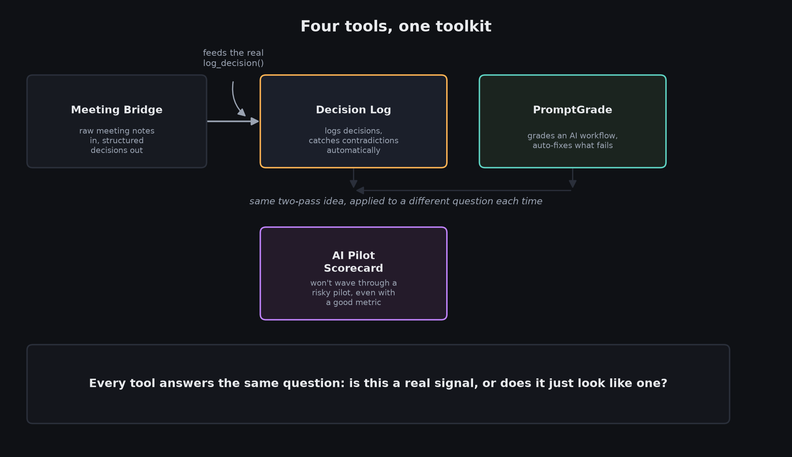
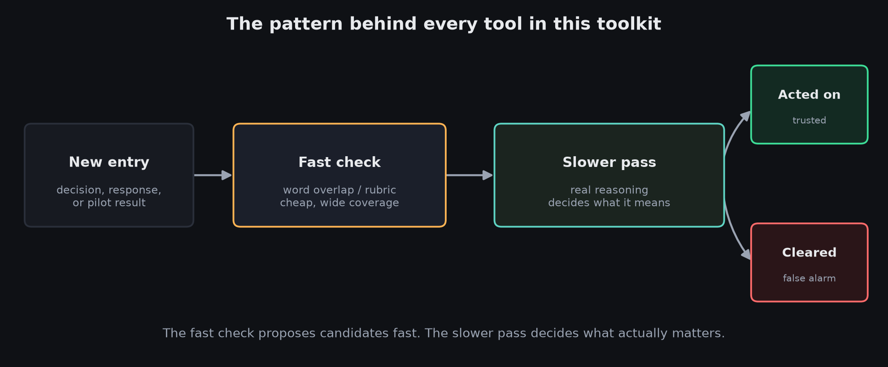

# AI Decision / Prompt / Pilot Toolkit

Four small, working tools built around one idea: **a fast, cheap, deterministic check can propose or flag, it can't judge.** Telling a real match from a coincidental one, or a correct answer from a differently-worded one, takes actual reasoning. Each tool pairs a cheap first-pass filter with a genuine reasoning layer on top, and each one is proven live in its own README with a real example of where the cheap layer alone gets it wrong.

Full narrative writeup: [PORTFOLIO.md](./PORTFOLIO.md)

## The four tools

| | Problem | Try it |
|---|---|---|
| **[Decision Log](./mcp-decision-log)** | Decisions get made and forgotten, the outcome sticks around, the reasoning doesn't. An MCP server that proactively catches duplicate or contradicting decisions before they cause friction, and clears false alarms automatically. | `cd mcp-decision-log && python demo.py` |
| **[PromptGrade](./promptgrade)** | Teams trust an AI-assisted process because it "seemed fine" a few times, then find out it fails in ways nobody caught. A self-patching eval harness that grades responses, diagnoses failures, and fixes its own prompt automatically. | `cd promptgrade && python harness.py v1` |
| **[AI Pilot Scorecard](./pilot-scorecard)** | AI pilots stall out because nobody defined success upfront. An interactive tool that locks in a success threshold before a trial runs, then won't recommend scaling a pilot, even a metrically successful one, if it carries unreviewed risk. | Open `pilot-scorecard/index.html` in any browser |
| **[Meeting Bridge](./meeting-bridge)** | Decisions get made in meetings and never make it into anything searchable. Extracts candidate decisions from raw meeting notes and logs them through the real Decision Log tool above, proving the tools compose into an actual pipeline, not standalone demos. | `cd meeting-bridge && python extract.py` |

## Why these, together

Each targets the same failure mode from a different angle: trusting a fast signal, word overlap, a keyword match, a passing metric, as if it were a real judgment. The fix is the same shape every time: keep the fast layer for what it's actually good at (speed, coverage), and put real reasoning where the decision actually happens.

No project here requires an API key to run. Every result shown in each README was captured from a real, live run of the code in this repo, including the cases where the fast layer alone gets it wrong.
